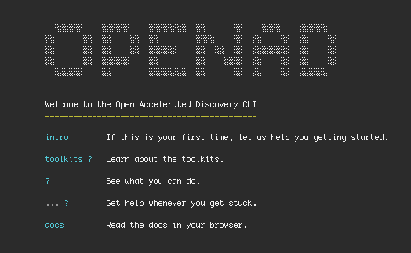

# Open Accelerated Discovery

**Opensource Toolkits for Molecular Science**

<!--  -->

OpenAD is an open-source framework for molecular and materials discovery developed by IBM Research.

The OpenAD client is accessible from a command line interface, Jupyter Notebooks and an API. It provides unified access to a variety of tools and AI models for literature knowledge extraction, synthesis prediction (forward and retro-), generative methods and property inference. You can train models on your own data as well as visualize and filter candidate molecules.

## Toolkits

The OpenAD Beta integrates with the following IBM Research [toolkits](#toolkits):

- ### [DS4SD](https://ds4sd.github.io/)

  _Deep Search for Scientific Discovery_ 
  Connecting & ingesting unstructured data 
  [DS4SD Docs](https://ds4sd.github.io/deepsearch-toolkit/)
  {: .no-gap }
  

  
More

  

      
The Deep Search toolkit uses AI to convert unstructured PDF documents into structured JSON files and enables you to automate knowledge extraction.

      
You can use it for both public and proprietary documents.

  

  

- ### [RXN](https://rxn.res.ibm.com/)

  Computational Chemistry 
  [RXN Video tutorials](https://rxn.app.accelerate.science/rxn/learn) (account required)
  {: .no-gap }
  

  
More

  

      
The Reaction toolkit uses AI to predict chemical reactions, retrosynthesis pathways and experimental procedures.

      
You can train AI models to build intelligence in your specific chemistry domain, and scale your analysis and model training while securing your data using features of the Discovery Platform.

  

  

- ### [GT4SD](https://github.com/GT4SD/gt4sd-core)

  Coming soon 
  _Generative Toolkit for Scientific Discovery_ 
  Molecular modeling & inferences
  {: .no-gap }
  

  
More

  

      The Generative Toolkit accelerates hypothesis generation in the scientific discovery process. It provides a library for making state-of-the-art generative AI models easier to use.
  

  

- ### [ST4SD](https://st4sd.github.io/overview/)

  Coming soon 
  _Simulation Toolkit for Scientific Discovery_ 
  Virtual Experiments
  {: .no-gap }
  

  
More

  

      
The Simulation Toolkit simplifies the development, execution and dissemination of virtual experiments.

      
A virtual experiment is an application workflow which measures one or more characteristics of one or more input systems. It is the computational analog of a lab experiment.

  

  

