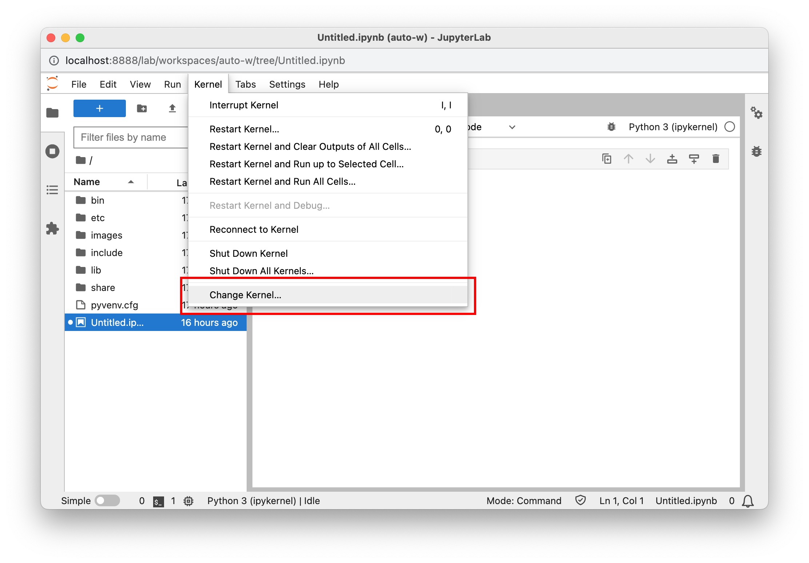
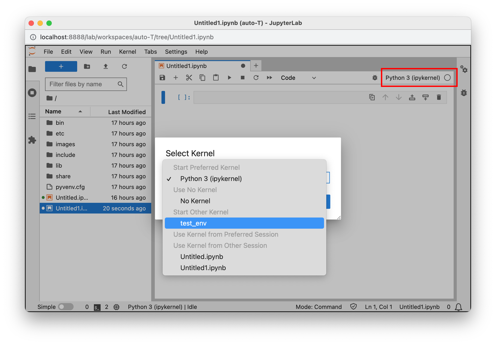
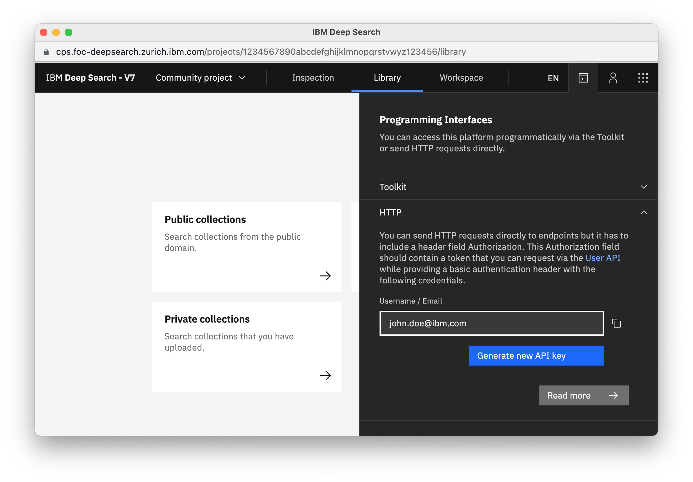
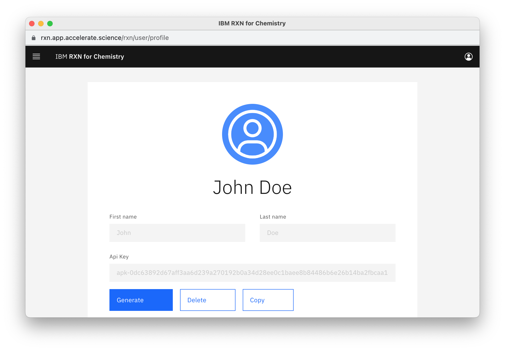
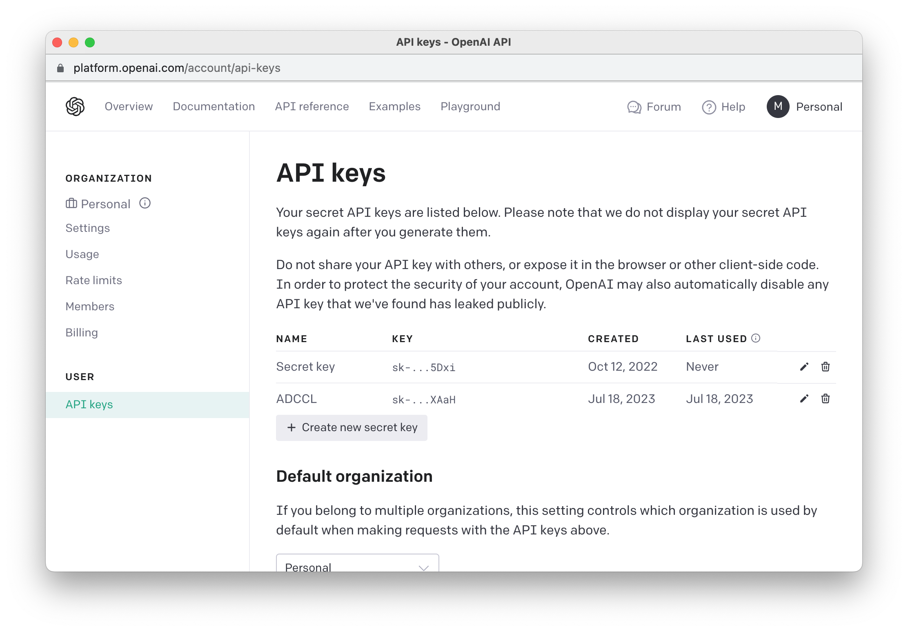

## tl;dr <!-- omit from toc -->

    pip install git+https://github.com/acceleratedscience/open-ad-toolkit.git
    openad/setup.sh
    poetry shell

"openad/setup.sh" is incorrect, see below
 

CLI:

    openad

Jupyter:

    jupyter lab ~/openad_notebooks/Table_of_Contents.ipynb

## Table of Contents <!-- omit from toc -->

-   [Installation](#installation)
-   [Getting Started - CLI](#getting-started---cli)
-   [Getting Started - Jupyter](#getting-started---jupyter)
-   [Interacting with the Toolkits](#interacting-with-the-toolkits)
    -   [Registration](#registration)
    -   [Adding a Toolkit](#adding-a-toolkit)
    -   [Sample Commands](#sample-commands)
    -   [Running Bash Commands (CLI)](#running-bash-commands-cli)
-   [AI Assistant](#ai-assistant)
-   [Contribute](#contribute)
    -   [Installation for Development](#installation-for-development)
    -   [Testing a branch](#testing-a-branch)
-   [Installing on Windows](#installing-on-windows)
    -   [Before you start](#before-you-start)
    -   [Installing WSL](#installing-wsl)

### Before You Start <!-- omit from toc -->

-   OpenAD is available for Linux and MacOS
-   We support Windows 11 via WSL 2 (ubuntu 22.04) - see [Installing on Windows](#installing-on-windows)
-   When not installing into a virtual environment on MacOS, you may need to use `python3` and `pip3` instead of `python` and `pip` respectively 

# Installation

> **Note:** Contributors should skip to [Installation for Development](#installation-for-development)

Run the following commands in your terminal:

1.  **Step 1: Download**

        pip install git+https://github.com/acceleratedscience/open-ad-toolkit.git

    <!-- > _**Note:** You need to have SSH enabled for this command to work. Alternatively you can simply download the repository._ -->

    
@Phil SSH/HTTP, does it matter? Enterprise instructions used SSH but that doesn't seem to work with the public repo ("fatal: Could not read from remote repository.")

    
@Daniel current instructions from Phil say "If you have an existing Poetry Project simply run `poetry add git+https://github.com/acceleratedscience/open-ad-toolkit.git`" but this results in error for me "Poetry could not find a pyproject.toml file". I want to understand what "having an existing poetry project" means to see if we should include this or not.

    
@Daniel I'd like to walk over <a href="https://acceleratedscience.github.io/open-ad-toolkit/docs/getting_started.html">current instructions</a> with you to make sure these our outdated: - "Installing via Pip" - "Use Jupyter Notebooks"

2.  **Step 2: Install**

        /opt/homebrew/lib/python3.11/site-packages/openad/setup.sh

@Daniel This path name would bedifferent per user, how can we activate the setup script more elegantly?

@Daniel Is download/install the right terminology? The download step is an install itself...

# Getting Started - CLI

Run the following command in the terminal:

-   **Entering the virtual environment**

    > **Note:** This step can be skipped if you chose to install OpenAD globally.

         poetry shell

@Daniel Is poetry shell launching the venv? Wanna make sure I describe it correctly

@Daniel Can this step indeed be skipped when installing globally?

-   **Entering the command shell**

         openad

    
@Daniel Is "shell" the right term? It's a bit confusing given that the previous command was "poetry shell"

    <!--  -->

    

-   **Exiting the command shell** 
    Hit `ctrl+c` or run:

        exit

-   **Running a single command from outside the command shell**

        openad <command>

-   **Exiting the virtual environment** 

        deactivate

    
@Daniel Is this the right command?

# Getting Started - Jupyter

The easiest way to get started in Jupyter is by taking a look at the examples. You should find them at `~/openad_notebooks`, or if they're not installed you can run `init_examples`.

@Daniel Can you confirm init_examples is part of the poetry install?

-   **Open the table of contents**

        jupyter lab ~/openad_notebooks/Table_of_Contents.ipynb

-   **Select the kernel** 
    Make sure to select the "ad-kernel" iPython kernel. You can do this under _Kernel > Change Kernel_, or in the latest versions of Jupyter by clicking the kernel name in the top right hand corner.

<figure>
    
    <figcaption align="center" style="font-size:0.9em;opacity:.6;margin-top:-30px;margin-bottom:50px"><i>Jupyter Notebook</i></figcaption>
</figure>
<figure>
    
    <figcaption align="center" style="font-size:0.9em;opacity:.6;margin-top:-30px;margin-bottom:50px"><i>Jupyter Lab</i></figcaption>
</figure>

-   **Magic Commands** 
    Magic commands let you run terminal commands from within Jupyter. They are invoked by the `%openad` prefix. All OpenAD CLI commands can be accessed like this. For example: 

        %openad list files

# Interacting with the Toolkits

OpenAD integrates with `DS4SD`, `RXN`, and has placeholder support for `GT4SD` and `ST4SD`.

<b>&#x26A0; Reminder:</b> when running commands from Jupyter, prepend them with `%openad`

### Registration

Before you can interact with the toolkits, you'll need to register with each individual toolkit.

Register with DS4SD (DeepSearch)

1. First, you'll need to generate an API key on the DeepSearch website.

    - Visit the DeepSearch website and create an account: 
      [deepsearch-experience.res.ibm.com](https://deepsearch-experience.res.ibm.com) 
    - Once logged in, click the Toolkit/API icon in the top right hand corner, then open the HTTP section
    - Click the "Generate new API key" button 
       
      <!--  -->
      

2. Once inside the OpenAD client, you'll be prompted to authenticate when activating the DeepSearch (DS4SD) toolkit. When running `set context ds4sd` :

    - **Hostname:** [https://sds.app.accelerate.science](https://sds.app.accelerate.science)
    - **Email:** Your email
    - **API_key:** The DS4SD API key you obtained following the instructions above. 
        > **Note:** Your DS4SD auth config file is saved as `~/.openad/ds-auth.ext-v2.json`. If you ever want to reset your DS4SD login information, simply delete this file. 

3. You should get a message saying you successfully logged in.
 

Register with RXN

1.  First, you'll need to generate an API key on the RXN website.

    -   Sign up for an RXN account at [rxn.app.accelerate.science](https://rxn.app.accelerate.science)
    -   Obtain your API key by clicking the user profile icon in the top right hand corner and select "My profile". 
         
        <!--  -->
        

2.  When setting the context to RXN using `set context rxn` you'll be prompted to create a new auth configuration file:

    -   **Hostname:** [https://rxn.app.accelerate.science](https://rxn.app.accelerate.science) 
    -   **API_key:** The RXN API key you obtained following the instructions above.

3.  You should get a message saying you successfully logged in. 

    > **Note:** Your RXN auth config file is saved as `~/.openad/rxn-auth.ext-v2.json`. If you ever want to reset your RXN login information, simply delete this file. You can also do this by running `set context ds4sd reset` 

### Adding a Toolkit

    add toolkit ds4sd # Install the toolkit
    set context ds4sd # Enter the toolkit environment

### Sample Commands

    # DS4SD
    display all collections

    # RXN
    list rxn models

### Running Bash Commands (CLI)

To run a command in bash mode, prepend it with `openad` and make sure to escape quotes.

    openad show molecules using file \'base_molecules.sdf\'

 

# AI Assistant

To enable our AI assistant, you'll need an account with OpenAI. There is a one month free trial.

> **Note:** WatsonX coming soon

1. Go to [platform.openai.com](https://platform.openai.com) and create an account

2. Click on the profile icon in the top right and choose "View API keys"

3. Create a new key

4. Run `tell me` to be prompted for your OpenAI API credentials

5. Your hostname is [https://api.openai.com/v1/models](https://api.openai.com/v1/models)

<!--  -->

# Contribute

OpenAD is fully open source and we encourage contributions. We plan to provide documentation on how to integrate your own toolkits in the future.

If you have any questions in the meantime, please [reach out]().

### Installation for Development

Run the following commands in your terminal:

1.  **Step 1: Download**

        # Main branch
        git clone git@github.com:acceleratedscience/open-ad-toolkit.git

        # Specific branch
        git clone -b <branch_name> git@github.com:acceleratedscience/open-ad-toolkit.git

2.  **Step 2: Install**

        openad/setup.sh

Currently the folder is called "openad_opentoolkit" but this should be changed

@Daniel/Phil Should we use "cd openad" + "./setup.sg" instead? Is there a reason for the CLI to point to the repo?

### Testing a branch

To do a regular install from a particular branch, you can run:

    pip install git+https://github.com/acceleratedscience/open-ad-toolkit.git@<branch_name>

# Installing on Windows

In order to run OpenAD on Windows 11, you will need to install the Ubuntu WSL package ("Windows Subsystem for Linux").

### Before you start

-   **Verify Windows version** 
    To check if you are running Windows 11 or later, press `Win` + `R`, type "winver", and press `Enter`. A window will open showing your Windows version.

-   **Verify WSL** 
    To check if you already have WSL installed, run `wsl -l -v` into the terminal. To see more information about your current version of Ubuntu, run `lsb_release -a`

### Installing WSL

Install WSL and create a user called 'openad' or one of your choosing.

    wsl --install Ubuntu-22.04

**Optional:** If you wish to setup an Ubuntu Python environment from scratch.

@Phil The original instruction was unclear to me: "If Running WSL ubuntu or you wish to setup a ubuntu python environment from scratch run the below to setup the environment
"

    sudo add-apt-repository ppa:deadsnakes/ppa
    sudo apt update
    sudo apt install python3.11-full
    sudo apt install python3-pip
    sudo update-alternatives --install /usr/bin/python3 python3 /usr/bin/python3.11 100
    sudo pip install pip --upgrade

You may also need to setup the default iPython profile for magic commands

@Phil What's the context here of "you may have to"?

    ipython profile create

@Phil section about <a href="https://acceleratedscience.github.io/open-ad-toolkit/docs/getting_started.html">manually adding magic commands</a>, do we need this?

<!--

For screenshots to look good, they should be small and ideally
all the same size. The script below lets you open the URLs in
the right size. Just paste this into the browser console and
press enter.

To take the screenshots with browser UI included on Mac, press
cmd+shift+4 followed by the spacebar, then click the window.
For consistency, stick to Chrome.

- - -

urls = [
    'https://cps.foc-deepsearch.zurich.ibm.com',
    'https://rxn.app.accelerate.science',
    'https://sds.app.accelerate.science',
    'https://platform.openai.com/account/api-keys'
]
for (var i=0; i< urls.length; i++) {
    window.open(urls[i], '_blank', 'width=1000,height=600');
}

-->
